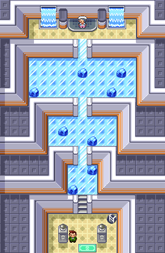

# Project-Pokemon

This repository contains a program to solve the puzzles found in Sootopolis City Gym, from the games Pokemon Ruby and Pokemon Emerald. In the puzzle, the player must step on every tile on a level before the ladder appears. Thus, the player must start at the bottom center of each level, step on every tile, and end on the top center of the level. 

To solve the problem, the level is encoded as an array of 0s and 1s, where 1 represents boulders and 0 represents a possible step. After reading in the layout of the level, the function "create_cnf_rules" creates an encoding of the rules specific to the level. Then, the rules are run through a SAT solver to solve the puzzle.

Specifically, these rules are encoded into the SAT Solver: 

1. The player must start on the given "start" tile.
2. The player must end on the given "end" tile.
3. For each step, at least one tile must be true.
4. For each step, at most one tile must be true. (Together with 3, this means only one tile is true at each step. This makes sense since the character may occupy only one tile at a time).
5. Each tile is used at least once by the end of the path.
6. Each tile is used at most once by the end of the path. (Together with 5, this means each tile is used exactly once by the end of the path, a necessary condition for the puzzle).
7. The path must be continuous (the player cannot jump between two disconnected tiles).

